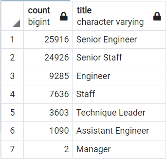
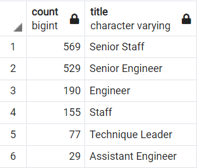

# Pewlett Hackard Analysis

## Overview

We were asked to wriite a query using the company data to determine the number of employees that are retiring based on their title. The tools we used were PGAdmin and PostgreSQL.

## Results

### Charts of the Findings.

#### Count of retiring employees by title.

#### Count of employees eligible for mentorship.

### Findings

Results: Provide a bulleted list with four major points from the two analysis deliverables. Use images as support where needed.

## Summary

### Summary of Results
   Summary: Provide high-level responses to the following questions, then provide two additional queries or tables that may provide more insight into the upcoming "silver tsunami."
        How many roles will need to be filled as the "silver tsunami" begins to make an impact?
        Are there enough qualified, retirement-ready employees in the departments to mentor the next generation of Pewlett Hackard employees?
