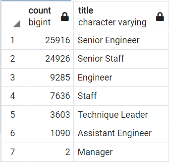
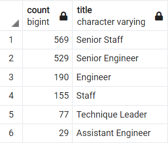

# Pewlett Hackard Analysis

## Overview

We were asked to wriite a query using the company data to determine the number of employees that are retiring based on their title. We were then asked to make a table of all the employees eligible for a mentorship. The tools we used were PGAdmin and PostgreSQL.

## Results

### Charts of the Findings.

#### Count of retiring employees by title.


#### Count of employees eligible for mentorship.


### Findings

- There is a large number of employees of retirement age.
- Based on the criteria for mentorship, there is not enough employees eligible
- PH hired alot of employees between 1952 and 1955
- PH will need to hire more people to replace all the employees retiring.

## Summary

### Summary of Results

From our findings, we can see that we will need to fill 72,458 roles in order to minimize the impact of the "Silver Tsunami". We determined the amount by running the following query. Look at chart of retiring employees picture above.

```
SELECT COUNT(rt.emp_no)
FROM retirement_titles AS rt
WHERE (rt.to_date = '9999-01-01');
```

We can see that we have that we have approximately 26,000 senior engineers and 25,000 senior staff that are well qualified and are able to mentor the next generation of PH employees. We can also expand the criteria to qualify more employees for the mentorship. From the requirements given, we can see that there isn't enough eligible and an abundant supply of mentors waiting. Please see the chart of employees eligible above.  We ran the following query to get the count of employees by title eligible for the mentorship.

```
SELECT COUNT (DISTINCT me.emp_no),
	me.title
INTO mentorship_count
FROM mentorship_eligibility as me
GROUP BY me.title
ORDER BY COUNT DESC;
SELECT * FROM mentorship_count;
```